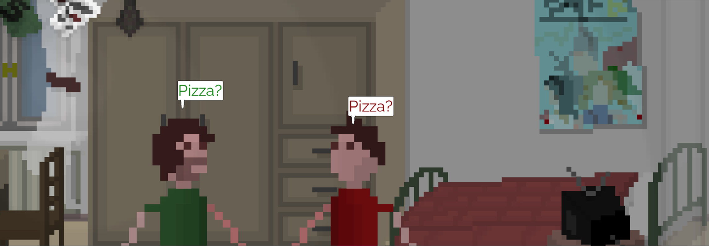
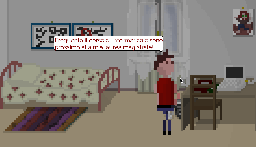

POMODORO (Bad Things in Perugia)
-------------------------



[](https://travis-ci.org/nardinan/pomodoro)

This is a very silly pixel-art adventure game written and developed by me and Luna Paciucci in two years, from scratch and during our spare time. The game follows the adventures of a younger version of myself on a very bizzarre day of June 2012 in the beautiful city of Perugia.



Originally, the game had been drafted as a PoC (Proof Of Concept) of some components in Miranda-media but, a few months after, we decided to give the game a real story and finish it.

Please keep in mind that:
 * The game is just for fun and potentially full of bugs
 * The english version of the game has **never** been tested and, due to the sheer number of dialogs, conversations and cut-scenes, we **never** reviewed it.

# Compile it

The game has been sucessfully compiled on Windows (windows 10, using MinGW), Linux (Ubuntu and Fedora) and MacOS (High Sierra).

### Dependencies
The game depends on the following libraries:
 * libmiranda (https://github.com/nardinan/miranda)
 * libSDL2
 * libSDL2_ttf
 * libSDL2_mixer
 * libSDL2_image

### Compilation on Ubuntu (and possibly any other _Debian-based_ distribution)

Open a terminal and install the SDL2 libraries using **apt**:
```bash
$ sudo apt-get install libsdl2-dev libsdl2-image-dev libsdl2-mixer-dev libsdl2-ttf-dev
```

Now that all the required SDL2 packages have been installed, it's time for Miranda:
```bash
$ git clone https://github.com/nardinan/miranda
$ cd miranda
$ make
$ sudo make install
```
Great! Miranda is now installed in your /usr/local/lib directory. **Be sure to add the corresponding entry "/usr/local/lib" to LD_LIBRARY_PATH (DYLD_LIBRARY_PATH on OSX).** After that, from your terminal, perform the following steps to build Pomodoro:
```bash
$ git clone https://github.com/nardinan/pomodoro
$ cd pomdoro
$ make
```

### Compilation on Mac OS X

On MacOS X, the installation procedure has been tested with Brew (https://brew.sh/). To install the SDL2 libraries via the *brew* command, type the following:
```bash
$ brew install sdl2 sdl2_image sdl2_ttf
$ brew install sdl2_mixer --with-flac --with-fluid-synth --with-libmikmod --with-mpg123 --HEAD
```
Once the libraries have been successfully installed, refer to the paragraph about the installation of Miranda and Pomodoro on the section 'Compilation on Ubuntu' above.

If you experience any problem during this procedure, then please let us know.

### Compilation on Windows

Well, we actually managed to compile the binary on Windows, but the instructions are left as an exercise for the reader.

# The game

The game has been designed and developed by me and Luna Paciucci (https://www.linkedin.com/in/paciucciluna/), musics are an original composition of Saverio Federici (http://www.saveriofederici.it). Also, I'm the author of the pixel-art graphics, and the 2D illustrations are an original work of Leonardo Carboni (https://www.facebook.com/leonardocarboniart/).

### Controls
The game can be controlled using the following keys:
* **arrow right** - move the character on the right
* **arrow right** (press twice and hold) - run to the right
* **arrow left** - move the character on the left
* **arrow left** (press twice and hold) - run to the left
* **left shift** - highlight all the interactable objects visible
* **space** - do something
* **esc** - quit the game

# Please help us

The game has not been really beta-tested and it would be awesome if you could help us by letting us know about any problems, bugs, crashes, typos, errors in the game or any other kind of feedback using the project **issues** tab.
Thank you for your cooperation.


